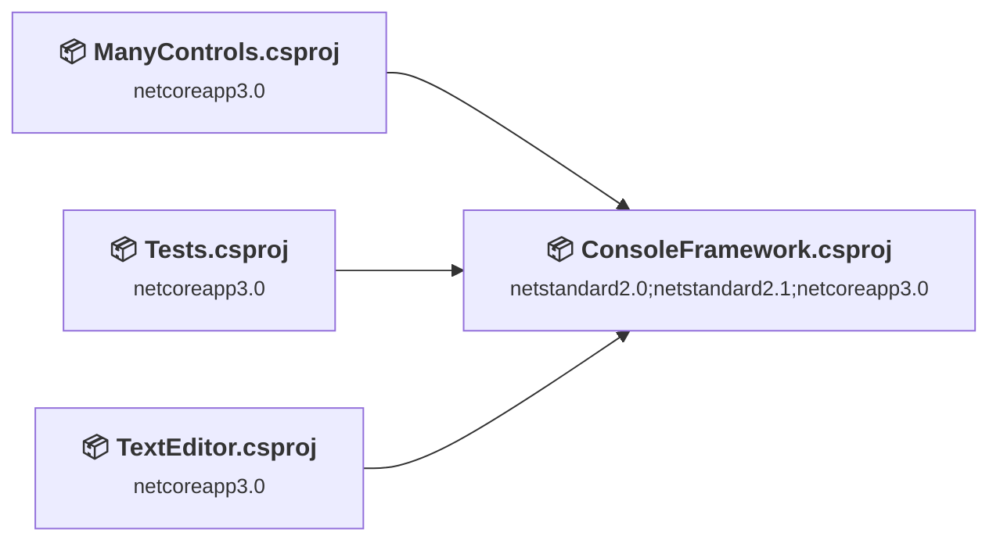
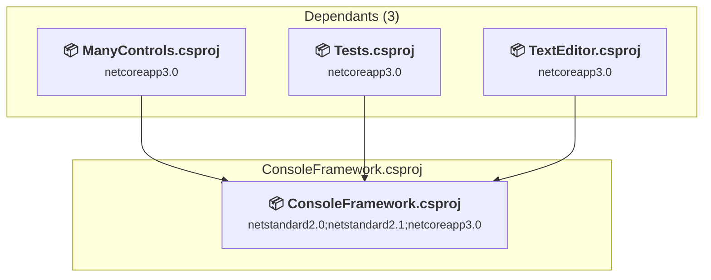
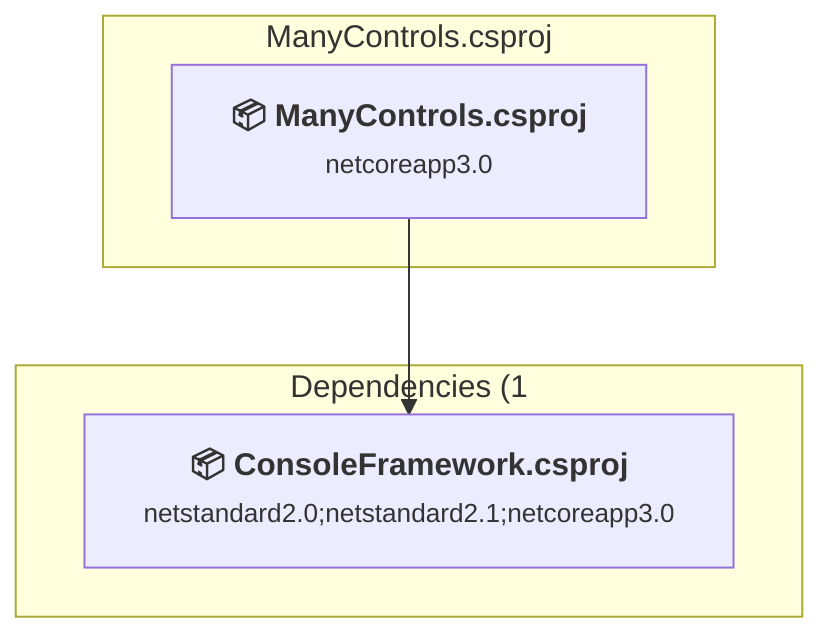
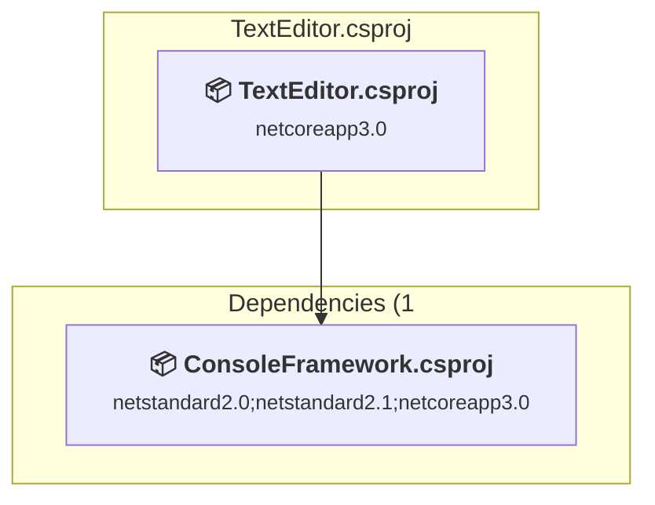
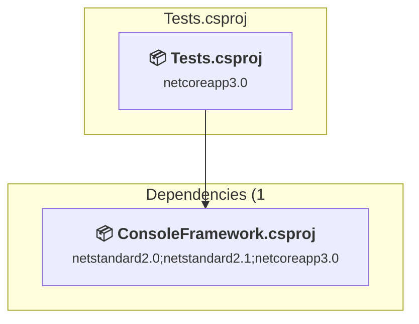

# Projects and dependencies analysis

This document provides a comprehensive overview of the projects and their dependencies in the context of upgrading to .NETCoreApp,Version=v10.0.

## Table of Contents

- [Executive Summary](#executive-Summary)
  - [Highlevel Metrics](#highlevel-metrics)
  - [Projects Compatibility](#projects-compatibility)
  - [Package Compatibility](#package-compatibility)
  - [API Compatibility](#api-compatibility)
- [Aggregate NuGet packages details](#aggregate-nuget-packages-details)
- [Top API Migration Challenges](#top-api-migration-challenges)
  - [Technologies and Features](#technologies-and-features)
  - [Most Frequent API Issues](#most-frequent-api-issues)
- [Projects Relationship Graph](#projects-relationship-graph)
- [Project Details](#project-details)

  - [ConsoleFramework\ConsoleFramework.csproj](#consoleframeworkconsoleframeworkcsproj)
  - [ExamplesStandalone\ManyControls\ManyControls.csproj](#examplesstandalonemanycontrolsmanycontrolscsproj)
  - [ExamplesStandalone\TextEditor\TextEditor.csproj](#examplesstandalonetexteditortexteditorcsproj)
  - [Tests\Tests.csproj](#teststestscsproj)

## Executive Summary

### Highlevel Metrics

| Metric | Count | Status |
| :--- | :---: | :--- |
| Total Projects | 4 | All require upgrade |
| Total NuGet Packages | 5 | All compatible |
| Total Code Files | 103 |  |
| Total Code Files with Incidents | 7 |  |
| Total Lines of Code | 18055 |  |
| Total Number of Issues | 9 |  |
| Estimated LOC to modify | 4+ | at least 0,0% of codebase |

### Projects Compatibility

| Project | Target Framework | Difficulty | Package Issues | API Issues | Est. LOC Impact | Description |
| :--- | :---: | :---: | :---: | :---: | :---: | :--- |
| [ConsoleFramework\ConsoleFramework.csproj](#consoleframeworkconsoleframeworkcsproj) | netstandard2.0;netstandard2.1;netcoreapp3.0 | 🟢 Low | 1 | 4 | 4+ | ClassLibrary, Sdk Style = True |
| [ExamplesStandalone\ManyControls\ManyControls.csproj](#examplesstandalonemanycontrolsmanycontrolscsproj) | netcoreapp3.0 | 🟢 Low | 0 | 0 |  | DotNetCoreApp, Sdk Style = True |
| [ExamplesStandalone\TextEditor\TextEditor.csproj](#examplesstandalonetexteditortexteditorcsproj) | netcoreapp3.0 | 🟢 Low | 0 | 0 |  | DotNetCoreApp, Sdk Style = True |
| [Tests\Tests.csproj](#teststestscsproj) | netcoreapp3.0 | 🟢 Low | 0 | 0 |  | DotNetCoreApp, Sdk Style = True |

### Package Compatibility

| Status | Count | Percentage |
| :--- | :---: | :---: |
| ✅ Compatible | 5 | 100,0% |
| ⚠️ Incompatible | 0 | 0,0% |
| 🔄 Upgrade Recommended | 0 | 0,0% |
| ***Total NuGet Packages*** | ***5*** | ***100%*** |

### API Compatibility

| Category | Count | Impact |
| :--- | :---: | :--- |
| 🔴 Binary Incompatible | 0 | High - Require code changes |
| 🟡 Source Incompatible | 4 | Medium - Needs re-compilation and potential conflicting API error fixing |
| 🔵 Behavioral change | 0 | Low - Behavioral changes that may require testing at runtime |
| ✅ Compatible | 12237 |  |
| ***Total APIs Analyzed*** | ***12241*** |  |

## Aggregate NuGet packages details

| Package | Current Version | Suggested Version | Projects | Description |
| :--- | :---: | :---: | :--- | :--- |
| Microsoft.NET.Test.Sdk | 15.3.0-preview-20170628-02 |  | [Tests.csproj](#teststestscsproj) | ✅Compatible |
| NETStandard.Library | 2.0.3 |  | [ConsoleFramework.csproj](#consoleframeworkconsoleframeworkcsproj) | ✅Compatible |
| System.Threading.Thread | 4.3.0 |  | [ConsoleFramework.csproj](#consoleframeworkconsoleframeworkcsproj) | NuGet package functionality is included with framework reference |
| xunit | 2.2.0 |  | [Tests.csproj](#teststestscsproj) | ✅Compatible |
| xunit.runner.visualstudio | 2.2.0 |  | [Tests.csproj](#teststestscsproj) | ✅Compatible |

## Top API Migration Challenges

### Technologies and Features

| Technology | Issues | Percentage | Migration Path |
| :--- | :---: | :---: | :--- |

### Most Frequent API Issues

| API | Count | Percentage | Category |
| :--- | :---: | :---: | :--- |
| M:System.TimeSpan.FromMilliseconds(System.Double) | 4 | 100,0% | Source Incompatible |

## Projects Relationship Graph

Legend:
📦 SDK-style project
⚙️ Classic project

## Project Details

### ConsoleFramework\ConsoleFramework.csproj

#### Project Info

- **Current Target Framework:** netstandard2.0;netstandard2.1;netcoreapp3.0
- **Proposed Target Framework:** netstandard2.0;netstandard2.1;netcoreapp3.0;net10.0
- **SDK-style**: True
- **Project Kind:** ClassLibrary
- **Dependencies**: 0
- **Dependants**: 3
- **Number of Files**: 85
- **Number of Files with Incidents**: 4
- **Lines of Code**: 16414
- **Estimated LOC to modify**: 4+ (at least 0,0% of the project)

#### Dependency Graph

Legend:
📦 SDK-style project
⚙️ Classic project

### API Compatibility

| Category | Count | Impact |
| :--- | :---: | :--- |
| 🔴 Binary Incompatible | 0 | High - Require code changes |
| 🟡 Source Incompatible | 4 | Medium - Needs re-compilation and potential conflicting API error fixing |
| 🔵 Behavioral change | 0 | Low - Behavioral changes that may require testing at runtime |
| ✅ Compatible | 11415 |  |
| ***Total APIs Analyzed*** | ***11419*** |  |

### ExamplesStandalone\ManyControls\ManyControls.csproj

#### Project Info

- **Current Target Framework:** netcoreapp3.0
- **Proposed Target Framework:** net10.0
- **SDK-style**: True
- **Project Kind:** DotNetCoreApp
- **Dependencies**: 1
- **Dependants**: 0
- **Number of Files**: 2
- **Number of Files with Incidents**: 1
- **Lines of Code**: 233
- **Estimated LOC to modify**: 0+ (at least 0,0% of the project)

#### Dependency Graph

Legend:
📦 SDK-style project
⚙️ Classic project

### API Compatibility

| Category | Count | Impact |
| :--- | :---: | :--- |
| 🔴 Binary Incompatible | 0 | High - Require code changes |
| 🟡 Source Incompatible | 0 | Medium - Needs re-compilation and potential conflicting API error fixing |
| 🔵 Behavioral change | 0 | Low - Behavioral changes that may require testing at runtime |
| ✅ Compatible | 91 |  |
| ***Total APIs Analyzed*** | ***91*** |  |

### ExamplesStandalone\TextEditor\TextEditor.csproj

#### Project Info

- **Current Target Framework:** netcoreapp3.0
- **Proposed Target Framework:** net10.0
- **SDK-style**: True
- **Project Kind:** DotNetCoreApp
- **Dependencies**: 1
- **Dependants**: 0
- **Number of Files**: 2
- **Number of Files with Incidents**: 1
- **Lines of Code**: 16
- **Estimated LOC to modify**: 0+ (at least 0,0% of the project)

#### Dependency Graph

Legend:
📦 SDK-style project
⚙️ Classic project

### API Compatibility

| Category | Count | Impact |
| :--- | :---: | :--- |
| 🔴 Binary Incompatible | 0 | High - Require code changes |
| 🟡 Source Incompatible | 0 | Medium - Needs re-compilation and potential conflicting API error fixing |
| 🔵 Behavioral change | 0 | Low - Behavioral changes that may require testing at runtime |
| ✅ Compatible | 3 |  |
| ***Total APIs Analyzed*** | ***3*** |  |

### Tests\Tests.csproj

#### Project Info

- **Current Target Framework:** netcoreapp3.0
- **Proposed Target Framework:** net10.0
- **SDK-style**: True
- **Project Kind:** DotNetCoreApp
- **Dependencies**: 1
- **Dependants**: 0
- **Number of Files**: 23
- **Number of Files with Incidents**: 1
- **Lines of Code**: 1392
- **Estimated LOC to modify**: 0+ (at least 0,0% of the project)

#### Dependency Graph

Legend:
📦 SDK-style project
⚙️ Classic project

### API Compatibility

| Category | Count | Impact |
| :--- | :---: | :--- |
| 🔴 Binary Incompatible | 0 | High - Require code changes |
| 🟡 Source Incompatible | 0 | Medium - Needs re-compilation and potential conflicting API error fixing |
| 🔵 Behavioral change | 0 | Low - Behavioral changes that may require testing at runtime |
| ✅ Compatible | 728 |  |
| ***Total APIs Analyzed*** | ***728*** |  |

